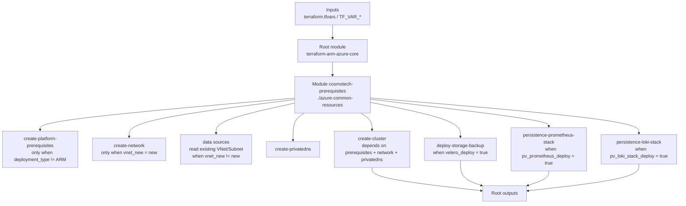

# Terraform ARM v3 Azure Core

[](https://www.terraform.io/)
[](https://registry.terraform.io/providers/hashicorp/azurerm/latest)
[](LICENSE.md)

Terraform root module for the Cosmo Tech platform **core Azure infrastructure**. It provisions the AKS cluster, networking (VNet/Subnet), Private DNS, and the storage components required by the platform.

## How this module works (simple)

### High-level behavior

1. `main.tf` computes a stable `cluster_name` (explicit `kubernetes_cluster_name` or generated suffix).
2. `modules.tf` calls `module "cosmotech-prerequisites"` (source: `./azure-common-resources`).
3. `outputs.tf` exposes key identifiers (cluster name, network info, etc.).

### Module flowchart

> Include a Mermaid.js flowchart to visualize the data flow of this process.



## What this module creates

This root module mainly wires the composite module in `./azure-common-resources` and exports usable outputs.

Depending on your variables, it can create or configure:

- Azure Resource Group (or reuse an existing one)
- Virtual Network + Subnet (new or existing)
- AKS cluster (+ node pools)
- Private DNS configuration
- Backup storage (Velero)
- Persistent disks/PVs for **Prometheus/Grafana** and **Loki**

## Repository layout

- `main.tf`: cluster name generation + Kubernetes provider locals
- `modules.tf`: wires `./azure-common-resources`
- `providers.tf`: providers + `azurerm` backend
- `outputs.tf`: exported outputs (consumed by other modules/pipelines)
- `variables.*.tf`: input variables grouped by topic
- `azure-common-resources/`: actual implementation (network, AKS, DNS, optional storage)
- Helper scripts: `_run-init.sh`, `_run-plan.sh`, `_run-apply.sh`, `_run-terraform.sh`

## Minimal usage

### Prerequisites

- Terraform (see `providers.tf` for required version)
- Azure CLI (`az`)
- An Azure Service Principal with required permissions in the target subscription

**Note**<br>
Before running this step, export the outputs of the `terraform-arm-publicip-dnsrecord` modules as `TF_VAR_` environment variables. This ensures that downstream modules (such as `terraform-arm-azure-core`) can consume these values.

```bash
source $PWD/out_core_ip_dns.txt
```

### Run with scripts

```bash
./_run-init.sh <state-key>
./_run-plan.sh terraform.tfvars
./_run-apply.sh
```

Or, simply run the `_run-terraform.sh` script to execute all three steps (init, plan, apply) in sequence. The script will stop if any step fails.

```bash
./_run-terraform.sh
```

## License

See `LICENSE.md`.

Made with :heart: by Cosmo Tech DevOps team
